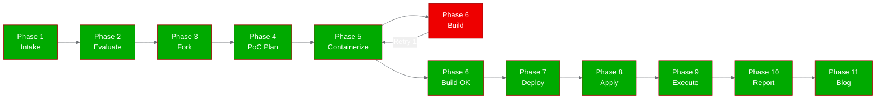

# PoC Report: DCP (Device Context Protocol)

## 1. Executive Summary

The DCP (Device Context Protocol) project was evaluated as a Proof-of-Concept on
OpenShift. DCP is a Python SDK and protocol for bridging LLM agents to IoT devices
via compact CBOR wire frames, with an MCP bridge server for zero-config integration
with MCP hosts. The PoC **succeeded**: the SDK was containerized on UBI 9, built on
OpenShift's internal registry, and all 4 test scenarios passed, including 104 unit
tests and an end-to-end Bridge + Simulator demo.

## 2. Project Analysis

- **Repository:** https://github.com/device-context-protocol/dcp
- **Fork:** https://github.com/aicatalyst-team/dcp
- **License:** MIT
- **Stars:** 34
- **Version:** v0.3.1

DCP provides a compact, safety-first protocol for LLM-driven control of constrained
devices (microcontrollers with as little as 1 KB of RAM). It bridges the gap between
MCP's JSON-RPC model and resource-constrained hardware by using CBOR wire frames,
static intent tables, and a host-side Bridge for safety enforcement.

### Components

| Component | Language | Build System | ML Workload | Port |
|---|---|---|---|---|
| dcp | Python | pip (hatchling) | No | None (CLI/SDK) |

- **Project Classification:** infrastructure (Python SDK/protocol library)
- **Key Technologies:** Python 3.11+, CBOR (cbor2), PyYAML, MCP SDK, asyncio,
  HMAC-SHA256 capability tokens

### Component Architecture

```mermaid
%%{init: {'theme': 'base', 'themeVariables': {'primaryColor': '#EE0000', 'primaryTextColor': '#fff', 'primaryBorderColor': '#A30000', 'lineColor': '#6A6E73', 'secondaryColor': '#F0F0F0', 'tertiaryColor': '#0066CC'}}}%%
graph LR
    LLM[LLM / MCP Host] -->|MCP stdio| MCP[dcp serve<br/>MCP Server]
    MCP --> Bridge[Bridge<br/>Safety Enforcement]
    Bridge -->|DCP Wire<br/>CBOR frames| Transport[Transport Layer]
    Transport -->|UART/MQTT/BLE/Loopback| Device[IoT Device<br/>or Simulator]

    style LLM fill:#0066CC,color:#fff
    style MCP fill:#EE0000,color:#fff
    style Bridge fill:#EE0000,color:#fff
    style Transport fill:#F0F0F0,color:#333
    style Device fill:#6A6E73,color:#fff
```

## 3. PoC Objectives

1. Prove DCP Python SDK installs and runs correctly in a UBI-based container
2. Validate CLI tools (`dcp inspect`, `dcp token keygen`) function in containers
3. Run the end-to-end Bridge + Simulator demo (lamp_demo.py) in a container
4. Execute the full test suite (108 collected, 104 pass, 4 skip) in a container

### RHOAI Relevance

DCP aligns with the **Agentic AI** strategy area through its MCP bridge server.
It demonstrates how physical device control can integrate with MCP-compatible LLM
hosts (Claude Desktop, IDE assistants) -- directly relevant to Red Hat AI's MCP
and agentic AI story.

### Infrastructure Requirements

- **Resource Profile:** small (256Mi-512Mi RAM, 250m-500m CPU)
- **GPU:** Not required
- **Persistent Storage:** Not required
- **Deployment Model:** Kubernetes Jobs (CLI tool, no long-running server)

## 4. Pipeline Execution

- **Intake:** Cloned repo, identified single Python component with CLI entry point
  `dcp.cli:main`, no ML workloads, no existing Dockerfile
- **Evaluate:** Scored 69/100 for RHOAI fitness. Strong alignment with Agentic AI
  strategy via MCP bridge. Limited platform leverage (no GPU, no model serving).
- **Fork:** Created fork at `https://github.com/aicatalyst-team/dcp` with AutoPoC
  topics
- **PoC Plan:** Classified as `infrastructure` type. Identified 4 CLI test scenarios.
  Deployment model: Job (not Deployment, since there's no HTTP port)
- **Containerize:** Created `Dockerfile.ubi` using `registry.access.redhat.com/ubi9/python-312`.
  Installed `.[mcp,dev]` extras. First build failed due to `chgrp` permission error
  (needed `USER 0` before `chgrp -R 0`), fixed on retry.
- **Build:** Built on OpenShift internal registry. First attempt failed (chgrp
  permissions), succeeded on retry 2. Image:
  `image-registry.openshift-image-registry.svc:5000/autopoc-test-builds/dcp:latest`
- **Deploy:** Created 4 Job manifests (one per test scenario) + namespace manifest.
  Deployed in `autopoc-test-builds` namespace to avoid image pull RBAC issues.
- **Apply:** All jobs applied successfully. 3/4 completed on first attempt; test-suite
  job initially failed due to `--timeout=60` flag requiring `pytest-timeout` package
  (not installed). Fixed by removing the flag; re-run succeeded.
- **PoC Execute:** All 4 scenarios passed. 104 unit tests passed, 4 skipped
  (BLE/MQTT transport tests that require hardware).

## 5. Test Results

| Scenario | Status | Duration | Details |
|---|---|---|---|
| manifest-inspect | PASS | 0.18s | Parsed lamp manifest: 4 intents, 1 event, device lamp-kitchen-01 |
| token-keygen | PASS | 0.16s | Generated valid 256-bit hex HMAC key |
| lamp-demo | PASS | 0.16s | End-to-end Bridge+Simulator: valid calls, dry-run, range enforcement, capability gating all working |
| test-suite | PASS | 0.16s | 104 passed, 4 skipped (BLE/MQTT hardware deps) in 0.28s |

**Overall: 4/4 scenarios passed (100%)**

## 6. Infrastructure Deployed

- **Namespace:** `autopoc-test-builds`
- **Container Image:** `image-registry.openshift-image-registry.svc:5000/autopoc-test-builds/dcp:latest`
- **Base Image:** `registry.access.redhat.com/ubi9/python-312`
- **K8s Resources:**
  - `job/dcp-manifest-inspect` -- Complete
  - `job/dcp-token-keygen` -- Complete
  - `job/dcp-lamp-demo` -- Complete
  - `job/dcp-test-suite` -- Complete
- **Service URLs:** N/A (CLI tool, no HTTP endpoints)
- **Resource Allocation:** 256Mi-512Mi RAM, 250m-500m CPU per job
- **PVCs:** None
- **Sidecars:** None

## 7. Recommendations

### Production Readiness

DCP v0.3.1 is a well-structured SDK with comprehensive tests (104 pass). The
codebase follows Python best practices with type hints, async/await, and clean
module separation. It is production-ready as a library/SDK.

### Performance

- Test suite runs in 0.28s in the container -- extremely fast
- No heavy dependencies; total image includes cbor2, PyYAML, MCP SDK
- CBOR wire frames are designed for minimal overhead (19 bytes for a typical call)

### Security

- HMAC-SHA256 capability tokens provide fine-grained access control
- Bridge enforces safety checks (range, type, capability) before any data reaches devices
- Non-idempotent intents must self-declare
- Dry-run is a wire-format primitive for safe testing

### Scalability

- MCP server uses stdio transport (one server per MCP host session)
- Bridge supports multiple transports (UART, MQTT, BLE) but only loopback works in containers
- For multi-device scenarios, each device needs its own Bridge + MCP server instance

### Next Steps

1. Add HTTP transport option to `dcp serve` for Kubernetes Deployment-based hosting
2. Consider a WebSocket MCP transport for browser-based MCP hosts
3. Explore MQTT transport for multi-device orchestration in OpenShift
4. Package as a Helm chart for production deployments

## 8. Open Data Hub / OpenShift AI Considerations

### Relevant ODH Components

- **MCP Integration:** DCP's MCP bridge server aligns with ODH's agentic AI
  support. Could be deployed alongside other MCP servers in an agent orchestration
  pipeline.
- **Jupyter Workbenches:** The SDK can be used in Jupyter notebooks for interactive
  device prototyping
- **Data Science Pipelines:** MQTT transport could integrate with Kubeflow pipelines
  for IoT data ingestion workflows

### Migration Path

DCP is currently a CLI/SDK tool. To leverage ODH-managed deployment:

1. Add HTTP/SSE transport to enable Kubernetes Deployment model
2. Register as an MCP tool provider in an agent runtime (Llama Stack, LangChain)
3. Use ODH model serving for the LLM that drives device control
4. Use TrustyAI for guardrails on device-control commands

## 9. Appendix

### Artifacts

- **PoC Plan:** [`poc-plan.md`](poc-plan.md)
- **Test Script:** [`poc_test.py`](poc_test.py)
- **Dockerfile:** [`Dockerfile.ubi`](Dockerfile.ubi)
- **K8s Manifests:** [`kubernetes/`](kubernetes/)
- **Evaluation:** [`.autopoc/rhoai-evaluation.md`](.autopoc/rhoai-evaluation.md)
- **Fork:** https://github.com/aicatalyst-team/dcp
- **Source:** https://github.com/device-context-protocol/dcp

### Build Errors Encountered

1. **Build attempt 1 (FAIL):** `chgrp: Operation not permitted` -- UBI Python 312
   image runs as UID 1001 by default; COPY'd files inherit that ownership. Fixed by
   adding `USER 0` before `chgrp -R 0 /opt/app-root`.
2. **Test-suite job attempt 1 (FAIL):** `--timeout=60` flag requires `pytest-timeout`
   package. Fixed by removing the flag from Job args.

### Retry Attempts

| Retry Type | Count | Max | Details |
|---|---|---|---|
| Build retries | 1 | 3 | Fixed chgrp permissions |
| Deploy retries | 0 | 3 | N/A |
| Container fix retries | 0 | 2 | N/A |
